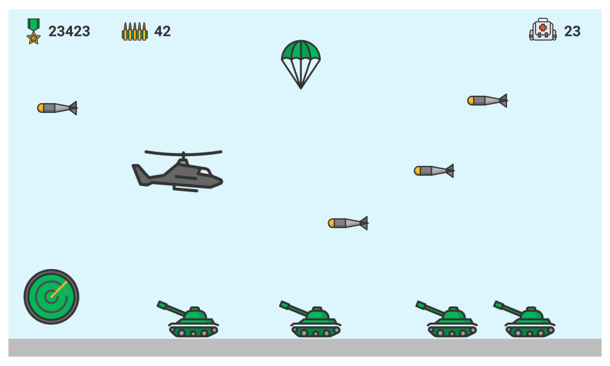

# platform-game

## Side scroller game

Example:

Perspective – top view or side view, you decide. The picture is just an example – it’s not
necessary to have all the objects that are shown on the picture. However the following is
mandatory:

- Player – moves up and down and the background is scrolling from right to left
- Obstacle – if the player touches the obstacle the game restarts itself
- Enemy - if the player touches the enemy the game restarts itself. It may fire a projectile
that may kill the player

UI counts the distance passed.