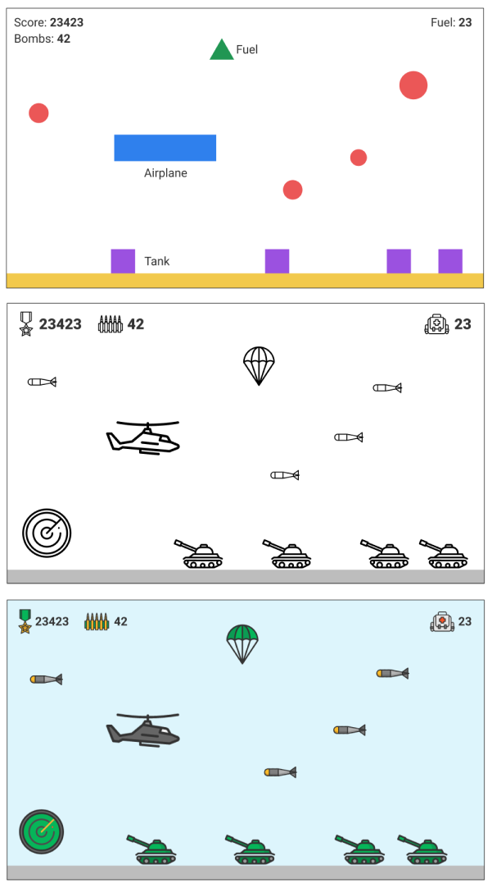

# platform-game / Side scroller game

1. Player: moves up and down and the background is scrolling from right to left
1. Obstacle: if the player touches the obstacle the game restarts itself
1. Enemy: if the player touches the enemy the game restarts itself. It may fire a projectile
that may kill the player
1. UI counts the distance passed.

> <small>Icons made by Freepik from www.flaticon.com</small>