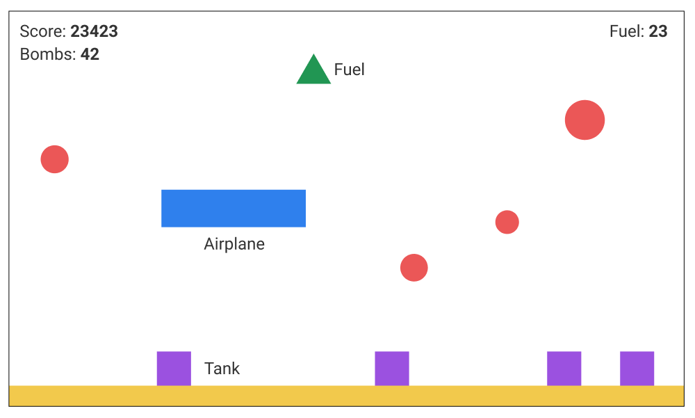
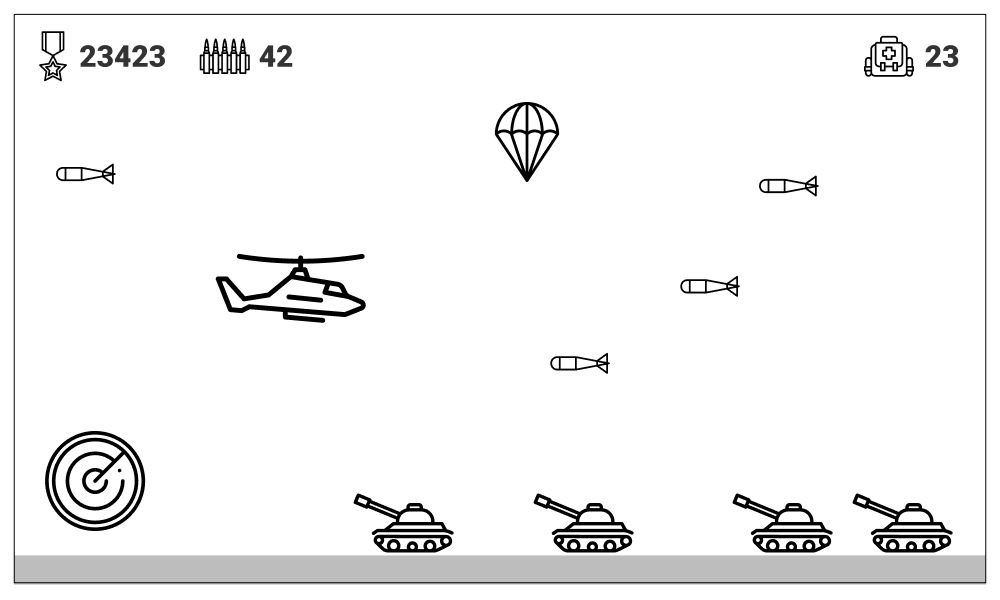

# platform-game / Side scroller game

- **Player** – moves up and down and the background is scrolling from right to left
- **Obstacle** – if the player touches the obstacle the game restarts itself
- **Enemy** - if the player touches the enemy the game restarts itself. It may fire a projectile
that may kill the player

UI counts the distance passed.

> Icons made by Freepik from www.flaticon.com